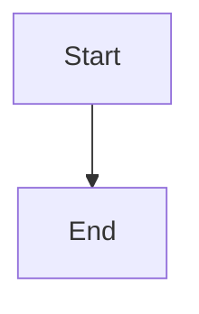

# Mermaid Diagrams

## Overview

This skill helps the agent produce clear Mermaid diagrams for process-heavy answers.
Use it when users explicitly request diagrams and proactively when an explanation is hard to follow without visual structure.

Primary goals:

- turn complex text workflows into readable Mermaid blocks,
- keep syntax valid and renderer-friendly,
- support both general software/system diagrams and computational biology pipelines.

## When to Use This Skill

Activate this skill when:

- user asks for a diagram, flowchart, sequence diagram, architecture map, or Mermaid output,
- response includes a complex process (multiple steps, branching, loops, or parallel paths),
- explanation spans multiple systems, tools, agents, or APIs,
- user asks how a workflow fits together end-to-end (especially FastFold workflows).

### Domain-specific triggers (computational biology / science)

- BoltzGen design pipeline (input prep -> draft -> upsert -> execute -> results),
- fold -> analysis -> OpenMM/OpenMMDL downstream workflows,
- candidate ranking/evaluation pipelines,
- multi-tool research/analysis execution flows.

## Diagram Selection Heuristic

Choose the simplest diagram that communicates the structure:

- **Flowchart**: default for step-by-step workflows and decision branches.
- **Sequence diagram**: interactions between user/agent/API/services over time.
- **State diagram**: lifecycle/status transitions.
- **ER diagram**: entities and relationships in data models.
- **Gantt/timeline**: schedule/milestone views.

If unsure, use a flowchart first.

## Proactive Behavior

For complex responses, proactively include a Mermaid diagram when it improves clarity.
Keep this lightweight:

1. Explain briefly in plain text.
2. Add one Mermaid diagram at the detail level that best fits workflow complexity and user intent.
3. Keep optional secondary detail in bullets (not extra diagrams by default).

Do not force diagrams for simple one-step answers.

## Output Requirements

Always output diagrams in fenced Mermaid blocks:

Quality requirements:

- valid Mermaid syntax that renders directly,
- concise node labels (avoid long paragraphs in nodes),
- logical naming and readable topology,
- no unnecessary decorative styling.

## Mermaid Safety + Rendering Rules

Follow these strictly to avoid broken diagrams:

- Use IDs without spaces (camelCase, PascalCase, or underscores).
- Wrap edge labels containing special characters in quotes.
- Wrap node labels with parentheses/colons/commas in quotes.
- Avoid reserved IDs like `end`, `graph`, `subgraph`, `flowchart`.
- Prefer `subgraph id [Label]` format for subgraphs.
- Do not use explicit colors/styles (`style`, `classDef`, custom fills).
- Do not use `click` handlers.

See [references/mermaid_syntax_rules.md](references/mermaid_syntax_rules.md).

## Workflow

1. Parse user goal and identify entities, transitions, and decisions.
2. Choose diagram type with the selection heuristic.
3. Draft Mermaid with valid IDs and minimal labels.
4. Self-check syntax and readability.
5. Return final Mermaid block, then optional short legend/notes if needed.

## FastFold / Computational Biology Templates

Use these as starting points and adapt to user context:

- [references/workflow_templates.md](references/workflow_templates.md)

Template coverage includes:

- BoltzGen design pipeline,
- fold -> MD workflow chain,
- agent-driven multi-step execution patterns.

## Guardrails

- Prefer one clear diagram over many dense diagrams.
- Do not invent unavailable systems/steps; reflect actual workflow behavior.
- Keep diagrams consistent with user-provided sequence and constraints.
- If uncertainty is high, ask for missing pipeline details before diagramming.
