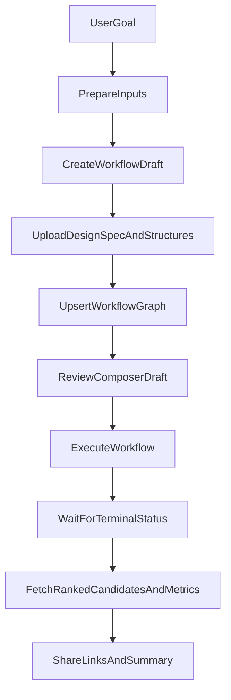
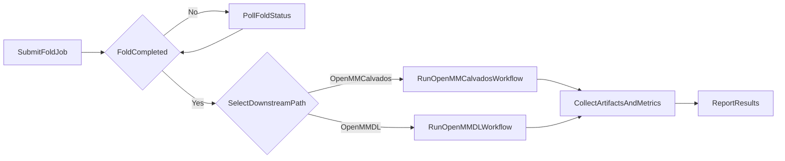
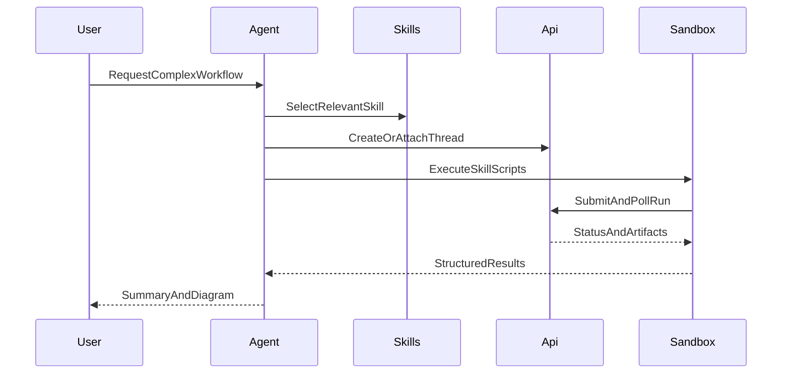
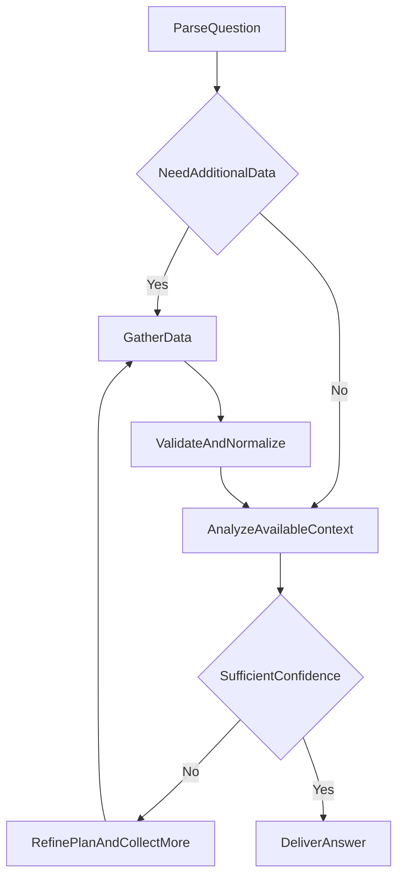

# Workflow Templates

These templates are starting points. Adapt names and steps to the user's request.

## 1) BoltzGen Design Pipeline (Flowchart)

## 2) Fold to MD Chain (Flowchart)

## 3) Agent-Orchestrated Multi-Step Execution (Sequence)

## 4) Research/Analysis Decision Flow (Flowchart)

